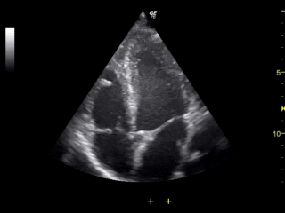

# EchoGANhance

## Premise

Cardiac ultrasound (echocardiography) is a cornerstone of the diagnostic and treatment algorithm for many cardiac diseases and is cheaper, safer, and more comfortable for the patient than alternative cardiovascular imaging modalities. Unfortunately, while echocardiography has remarkable temporal and spatial resolution, image quality can suffer from a low signal-to-noise ratio and a variety of artifacts that are produced by natural imaging barriers. The purpose of this project is to train a deep generative model that can produce high quality, diagnostic echocardiography images from lower quality studies that suffer from these artifacts. 

#### High Quality Study


#### Poor Quality Study


The purpose of this project is to train a deep generative model for unpaired image to image translation that can produce high quality, diagnostic echocardiography images from lower quality studies that suffer from these artifacts. 

#### CycleGANs (Zhu et al.)


The cycleGAN model allows for unpaired image to image translation by training two separate generators (GA->B and GB->A) and two separate discriminators (DA and DB) (see Figure 1). Each image from each domain is first converted to the opposite domain, then converted back to the original domain using the appropriate generators. This cyclic generation ensures that the transformations preserve the general features of the source image by enforcing a cycle consistency loss between the cyclically generated image and the original input image.  Moreover, an identity mapping loss serves as a sort of regularizer of the generators, by ensuring that if the GA->B is used for an image from the B domain, the same image is produced (identity) and vice versa. 

#### CycleGAN Hallucination (Cohen et al.)
 

CycleGANs are by nature susceptible to “hallucinating” features that are not in the original input image, particularly if there is over/underrepresentation of certain features in the training set since they are based on distribution matching losses (Cohen et al.). This can have critical implications in a domain where high-fidelity translation is essential, such as the medical imaging domain.

### UNetGAN and multi-task learning (Bosch AI)

 
 
 The discriminators in a cycleGAN enforce global realism of each domain transformation, however, local irregularities are not accounted for as the discriminator only provides a prediction of “real” or “fake” on the image as a whole. FCNN discriminators like the UNetGAN can enforce local and global realism simultaneously. Moreover, I used multitask learning to help resolve the problem of feature hallucination, including additional labels for clinically meaningful anatomic assessments such as left and right atrial enlargement, right and left ventricular size, and presence of left ventricular hypertrophy.  

### PatchGAN - settling for an alternative (Isola et al.)


70X70 Patch-based discriminator was used as the discriminator 5 convolutional blocks, predictions on image patches rather than the whole image. Used MSE (essentially L2 distance), and loss weighted by half to slow down updates to discriminator. 

### Code to generate the patchGAN discriminator: (borrowed from Jason Brownlee's excellent review in [MachineLearningMastery](https://machinelearningmastery.com/cyclegan-tutorial-with-keras/))

```
def define_discriminator(image_shape):
    # weight initialization
    init = RandomNormal(stddev=0.02)
    # source image input
    in_image = Input(shape=image_shape)
    # C64
    d = Conv2D(64, (4,4), strides=(2,2), padding='same', kernel_initializer=init)(in_image)
    d = LeakyReLU(alpha=0.2)(d)
    # C128
    d = Conv2D(128, (4,4), strides=(2,2), padding='same', kernel_initializer=init)(d)
    d = InstanceNormalization(axis=-1)(d)
    d = LeakyReLU(alpha=0.2)(d)
    # C256
    d = Conv2D(256, (4,4), strides=(2,2), padding='same', kernel_initializer=init)(d)
    d = InstanceNormalization(axis=-1)(d)
    d = LeakyReLU(alpha=0.2)(d)
    # C512
    d = Conv2D(512, (4,4), strides=(2,2), padding='same', kernel_initializer=init)(d)
    d = InstanceNormalization(axis=-1)(d)
    d = LeakyReLU(alpha=0.2)(d)
    # second last output layer
    d = Conv2D(512, (4,4), padding='same', kernel_initializer=init)(d)
    d = InstanceNormalization(axis=-1)(d)
    d = LeakyReLU(alpha=0.2)(d)
    # patch output
    patch_out = Conv2D(1, (4,4), padding='same', kernel_initializer=init)(d)
    # define model
    model = Model(in_image, patch_out)
    # compile model
    model.compile(loss='mse', optimizer=Adam(lr=0.0002, beta_1=0.5), loss_weights=[0.5])
    return model
    
```
## Loss Function


## Dataset and Preprocessing
The dataset I used for this project consists of 6,481 echocardiogram studies performed at Northwestern Medicine since 2015. These studies were performed for various indications and represent the typical distribution of pathologies that we see in practice. Of these studies, approximately 1,363 (~20%) were assessed as “poor/technically limited quality” by a board certified cardiologist in echocardiography. Each study has an average of ~75 clips contained within it, and each of these clips contains an average of ~30 frames. Overall, the dataset therefore contains ~15 million image frames for training, with ~3 million “low quality” examples and ~12 million “high quality” examples. 

For this pilot study, I used a smaller dataset of 578 studies, 87 of low quality. This accounted for a total of 170921 low quality frames and 1,172,179 validated high quality frames for training. Files were converted from the digital imaging and communications format (DICOM) to png for model training. 

## Training
The model best hyperparameters were to use an Adam Optimizer with a very low learning rate (0.0002) and batch size of 1 (instance normaliztion was performed. The following images demonstrate model improvement with training. 

100 Iterations


200 Iterations


500 Iterations


1000 Iterations


5000 Iterations


10000 Iterations


20000 Iterations


30000 Iterations


## Results

Below are some examples of our results on full echocardiographic clips after ~20,000 training iterations. Notice the checkering pattern that is known to plague GANs and the random adversarial noise. 

#### Original
https://user-images.githubusercontent.com/65331476/121435467-8fa75780-c944-11eb-9ae9-3b4d489cc5f6.mp4

#### Generated
https://user-images.githubusercontent.com/65331476/121435494-9c2bb000-c944-11eb-9f46-aeeb03d3b4a5.mp4


#### Original
https://user-images.githubusercontent.com/65331476/121435471-93d37500-c944-11eb-8b1f-2ee99c07c3a0.mp4

#### Generated
https://user-images.githubusercontent.com/65331476/121435517-a6e64500-c944-11eb-8cb3-d31951c3b222.mp4


#### Original
https://user-images.githubusercontent.com/65331476/121435543-b06fad00-c944-11eb-93df-77177c7e14e8.mp4

#### Generated
https://user-images.githubusercontent.com/65331476/121435559-b796bb00-c944-11eb-8305-2cb13b5f681f.mp4


#### Original
https://user-images.githubusercontent.com/65331476/121435586-c4b3aa00-c944-11eb-9667-76e1fa73e8cd.mp4

#### Generated
https://user-images.githubusercontent.com/65331476/121435600-ca10f480-c944-11eb-88aa-059bf6205810.mp4


## Future directions

Lessons were gleaned from this experience, particularly how unstable and finnicky GANs can be. I plan to continue this research incorporating illumination consistency loss and structural similarity loss as reported in the literature to improve performance of the system. I will also formally evaluate the performance of the system by calculating FID and IS scores. We will also test the ability of the quality transfer GAN to improve performance of downstream AI systems (like cardiac segmentation), the most practical application for such a system. Most importantly, I will curate a better dataset of only one frame per clip and target poor vs very high quality studies in order to have a more discernable difference between high quality and low quality studies for training. 

## References

Zhu JY, Park T, Isola P, Efros AA. CycleGAN. Proc IEEE Int Conf Comput Vis. 2017;2017-Octob:2242–2251.
2. 	Nguyen NM, Ray N. Task-GAN:improving generative adversarial network for image restoration. Proc - 2019 16th Conf Comput Robot Vision, CRV 2019. 2019;18(2017):129–134.
3. 	Wang R, Fang Z, Gu J, et al. High-resolution image reconstruction for portable ultrasound imaging devices. EURASIP J Adv Signal Process. EURASIP Journal on Advances in Signal Processing; 2019;2019(1).
4. 	Ma Y, Liu Y, Cheng J, et al. Cycle Structure and Illumination Constrained GAN for Medical Image Enhancement. Lect Notes Comput Sci (including Subser Lect Notes Artif Intell Lect Notes Bioinformatics). 2020;12262 LNCS(August):667–677.
5. 	Schönfeld E, Schiele B, Khoreva A. A U-Net Based Discriminator for Generative Adversarial Networks. arXiv. 2020;8207–8216.
6. 	Escobar M, Castillo A, Romero A, Arbeláez P. Ultragan: Ultrasound enhancement through adversarial generation. Lect Notes Comput Sci (including Subser Lect Notes Artif Intell Lect Notes Bioinformatics). 2020;12417 LNCS:120–130.
7. 	Armanious K, Jiang C, Fischer M, et al. MedGAN: Medical image translation using GANs. Comput Med Imaging Graph. 2020;79.
8. 	Goodfellow I, Pouget-Abadie J, Mirza M, et al. Generative adversarial networks. Commun ACM. 2020;63(11):139–144.
9.  Isola, Philip, Zhu, Jun-Yan,  Tinghui Zhou Alexei A. Efros. Image-to-Image Translation with Conditional Adversarial Networks. arXiv 2016.
